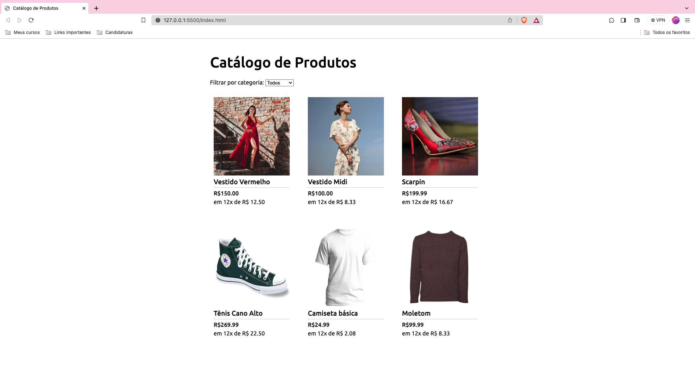

# Product Catalog | Using forEach( ) and filter( )

✅ Project Completed

<a href="#description">Description</a> •
<a href="#technologies">Technologies</a> •
<a href="#functionalities">Functionalities</a>

## Description

Page containing a product catalogue.

## Technologies

➡️ HTML  
➡️ CSS  
➡️ JavaScript

## Functionalities

<strong>Single page application with the following features:</strong>

On the page it is possible to filter by product category, this was done through the use of forEach() to add products dynamically and display them on the page, and through the use of filter() to return an array with all the elements that meet the filter condition.

